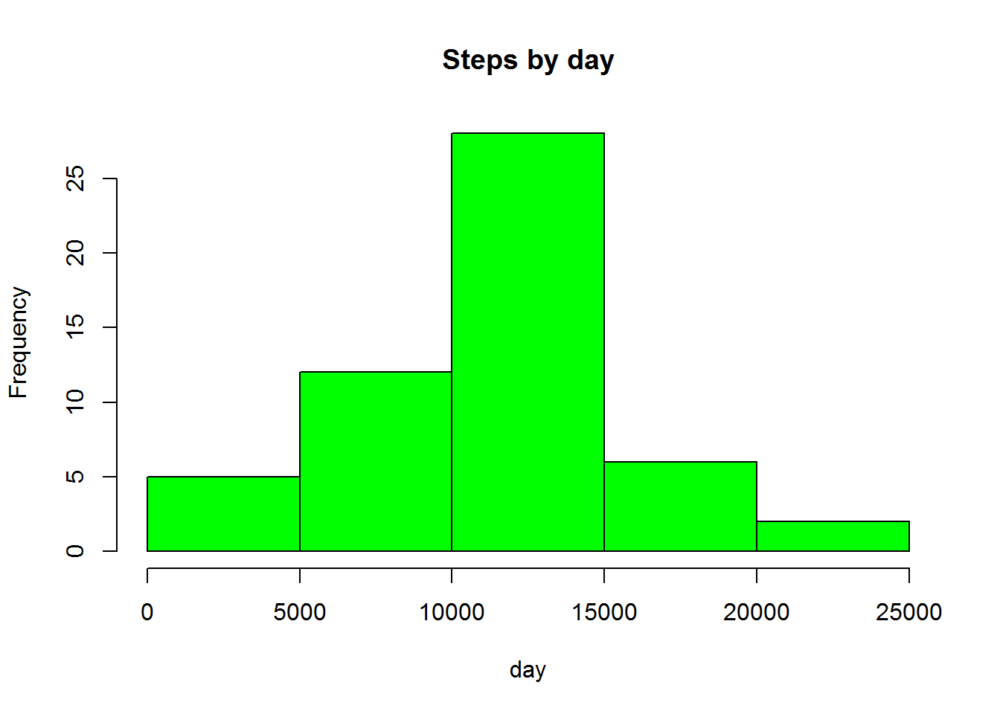
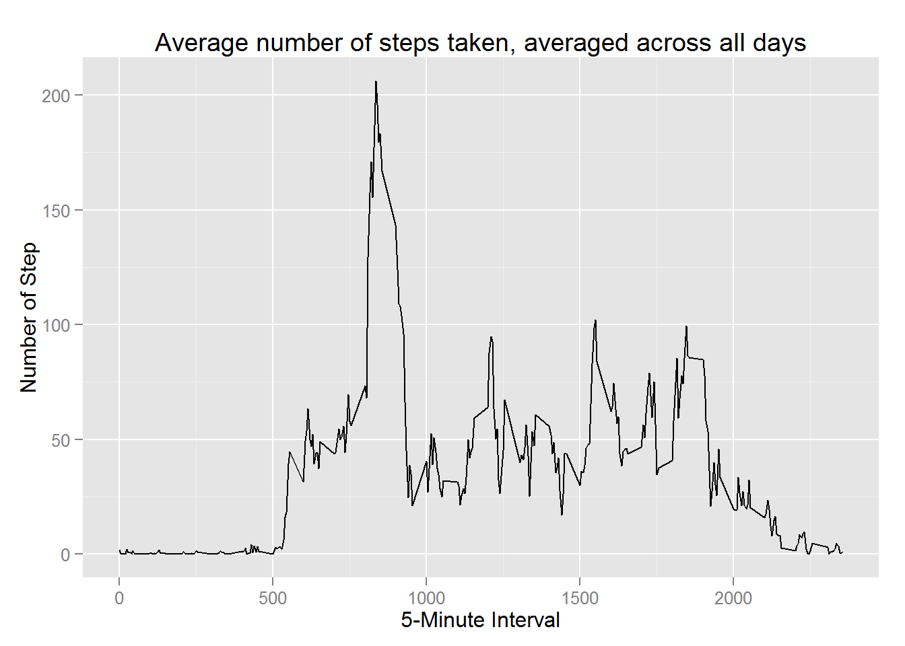
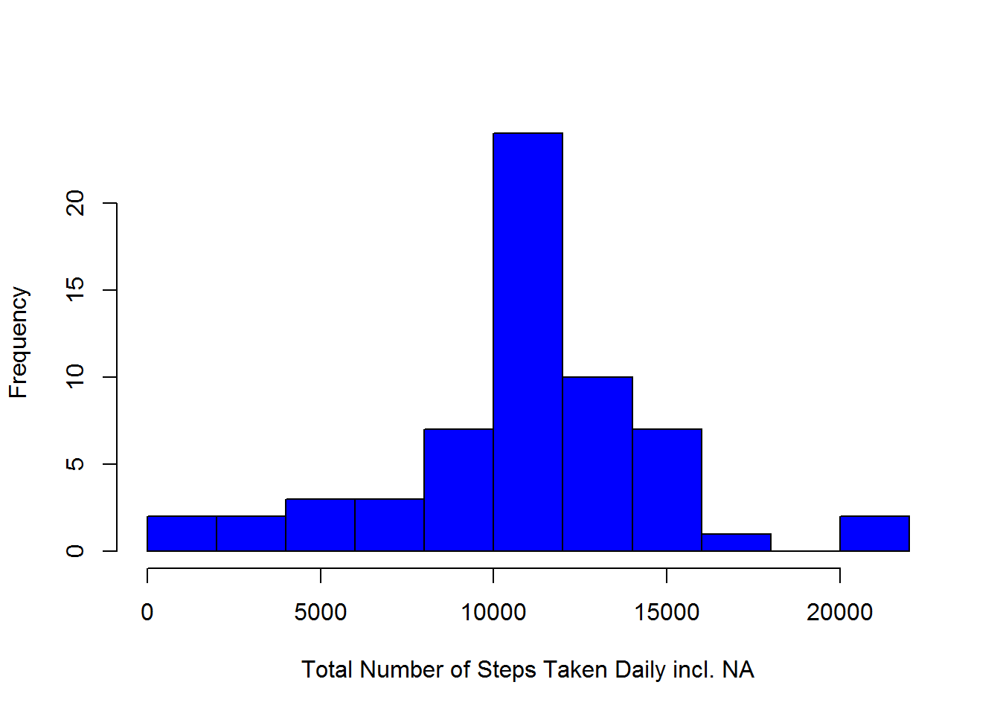
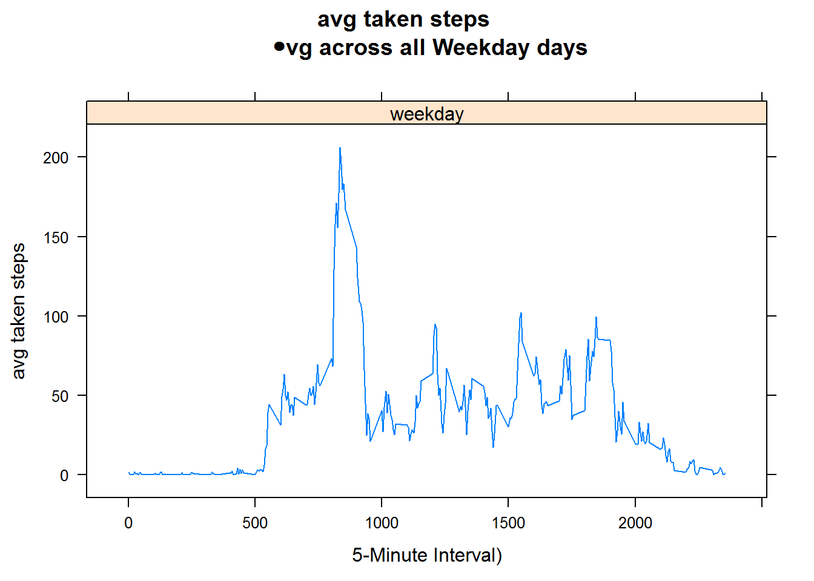

opts_chunk$set(echo=TRUE)


#Reproducible Research  -  Peer Assessments 1


setwd("D:/Schulungen/coursera/DataScience-Specialization/R-Developing/5 Reproducible Research")

##Loading and preprocessing the data


```r
activity_inp <- read.csv("activity.csv", colClasses = c("numeric", "character", "numeric"))
head(activity_inp)
```

```
##   steps       date interval
## 1    NA 2012-10-01        0
## 2    NA 2012-10-01        5
## 3    NA 2012-10-01       10
## 4    NA 2012-10-01       15
## 5    NA 2012-10-01       20
## 6    NA 2012-10-01       25
```

```r
# date to date type
activity_inp$date <- as.Date(activity_inp$date) 
```

##What is mean total number of steps taken per day?

Calculate the total number of steps taken per day


```r
library(dplyr)
act_no_na <- na.omit(activity_inp) 
steps_daily <- aggregate(steps ~ date, data = act_no_na, sum)
##steps_daily <- group_by(act_no_na, date)
steps_daily
```

```
##          date steps
## 1  2012-10-02   126
## 2  2012-10-03 11352
## 3  2012-10-04 12116
## 4  2012-10-05 13294
## 5  2012-10-06 15420
## 6  2012-10-07 11015
## 7  2012-10-09 12811
## 8  2012-10-10  9900
## 9  2012-10-11 10304
## 10 2012-10-12 17382
## 11 2012-10-13 12426
## 12 2012-10-14 15098
## 13 2012-10-15 10139
## 14 2012-10-16 15084
## 15 2012-10-17 13452
## 16 2012-10-18 10056
## 17 2012-10-19 11829
## 18 2012-10-20 10395
## 19 2012-10-21  8821
## 20 2012-10-22 13460
## 21 2012-10-23  8918
## 22 2012-10-24  8355
## 23 2012-10-25  2492
## 24 2012-10-26  6778
## 25 2012-10-27 10119
## 26 2012-10-28 11458
## 27 2012-10-29  5018
## 28 2012-10-30  9819
## 29 2012-10-31 15414
## 30 2012-11-02 10600
## 31 2012-11-03 10571
## 32 2012-11-05 10439
## 33 2012-11-06  8334
## 34 2012-11-07 12883
## 35 2012-11-08  3219
## 36 2012-11-11 12608
## 37 2012-11-12 10765
## 38 2012-11-13  7336
## 39 2012-11-15    41
## 40 2012-11-16  5441
## 41 2012-11-17 14339
## 42 2012-11-18 15110
## 43 2012-11-19  8841
## 44 2012-11-20  4472
## 45 2012-11-21 12787
## 46 2012-11-22 20427
## 47 2012-11-23 21194
## 48 2012-11-24 14478
## 49 2012-11-25 11834
## 50 2012-11-26 11162
## 51 2012-11-27 13646
## 52 2012-11-28 10183
## 53 2012-11-29  7047
```

Make a histogram of the total number of steps taken each day


```r
hist(steps_daily$steps, 
     main = "Steps by day", 
     xlab = "day", 
     col = "green")
```

 

Calculate and report the mean and median of the total number of steps taken per day


```r
mean(steps_daily$steps)
```

```
## [1] 10766.19
```

```r
median(steps_daily$steps)
```

```
## [1] 10765
```


##What is the average daily activity pattern?

Make a time series plot (i.e. type = "l") of the 5-minute interval (x-axis) and the average number of steps taken, averaged across all days (y-axis)


```r
library(plyr)
# Calculate average steps for each of 5-minute interval during a 24-hour period
interval_steps <- ddply(act_no_na,~interval, summarise, mean=mean(steps))

library(ggplot2)
qplot(x=interval, y=mean, data = interval_steps,  geom = "line",
      xlab="5-Minute Interval",
      ylab="Number of Step",
      main="Average number of steps taken, averaged across all days"
      )
```

 

Which 5-minute interval, on average across all the days in the dataset, contains the maximum number of steps?


```r
interval_steps[which.max(interval_steps$mean), ]
```

```
##     interval     mean
## 104      835 206.1698
```


##Imputing missing values

Note that there are a number of days/intervals where there are missing values (coded as NA). The presence of missing days may introduce bias into some calculations or summaries of the data.

    Calculate and report the total number of missing values in the dataset (i.e. the total number of rows with NAs)
    

```r
NA_activity <- sum(is.na(activity_inp))
NA_activity
```

```
## [1] 2304
```

```r
library(sqldf)
```

Devise a strategy for filling in all of the missing values in the dataset. The strategy does not need to be sophisticated. For example, you could use the mean/median for that day, or the mean for that 5-minute interval, etc.
Create a new dataset that is equal to the original dataset but with the missing data filled in.
    
    

```r
def_na <- sqldf('  
       SELECT full.*, m.mean
       FROM "interval_steps" as m
       JOIN "activity_inp" as full
       ON full.interval = m.interval 
       ORDER BY full.date, full.interval ') 

def_na$steps[is.na(def_na$steps)] <- def_na$mean[is.na(def_na$steps)]
```

Make a histogram of the total number of steps taken each day and Calculate and report the mean and median total number of steps taken per day. Do these values differ from the estimates from the first part of the assignment? What is the impact of imputing missing data on the estimates of the total daily number of steps?


```r
help1 <- as.integer( sqldf(' 
    SELECT sum(steps)  
    FROM def_na') );

help2 <- sqldf(' 
    SELECT date , sum(steps) as "ssum" 
    FROM def_na GROUP BY date 
    ORDER BY date') 


help3 <- sqldf('   
    SELECT date, ssum 
    FROM "help2"
    ORDER BY date') 


hist(help3$ssum, 
     main=" ",
     breaks=10,
     xlab="Total Number of Steps Taken Daily incl. NA",
     col = "blue")
```

 

```r
t1.mean.steps.per.day <- as.integer(help1 / NROW(help2) )
t1.mean.steps.per.day
```

```
## [1] 10766
```

```r
t1.median.steps.per.day <- median(help1 / NROW(help2))
t1.median.steps.per.day
```

```
## [1] 10766.18
```


##Are there differences in activity patterns between weekdays and weekends?

For this part the weekdays() function may be of some help here. Use the dataset with the filled-in missing values for this part.

Create a new factor variable in the dataset with two levels - "weekday" and "weekend" indicating whether a given date is a weekday or weekend day.


```r
def_na$weektime <- as.factor(ifelse(weekdays(def_na$date) %in% 
                c("Saturday","Sunday"),"weekend", "weekday"))

prep_data <- sqldf('   
    SELECT interval, avg(steps) as "mean.steps", weektime
    FROM def_na
    GROUP BY weektime, interval
    ORDER BY interval ')
```


Make a panel plot containing a time series plot (i.e. type = "l") of the 5-minute interval (x-axis) and the average number of steps taken, averaged across all weekday days or weekend days (y-axis). See the README file in the GitHub repository to see an example of what this plot should look like using simulated data.


```r
library("lattice")
p <- xyplot(mean.steps ~ interval | factor(weektime), data=prep_data, 
       type = 'l',
       main="avg taken steps 
       \avg across all Weekday days",
       xlab="5-Minute Interval)",
       ylab="avg taken steps")
print (p)  
```

 
